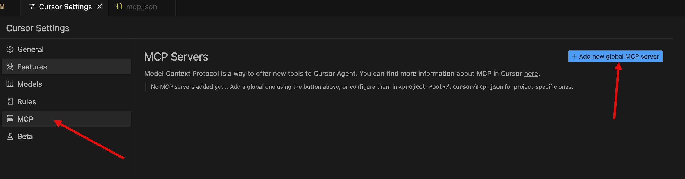
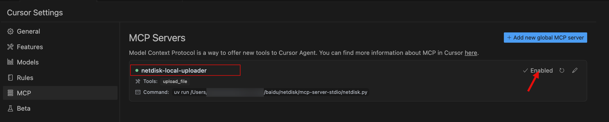
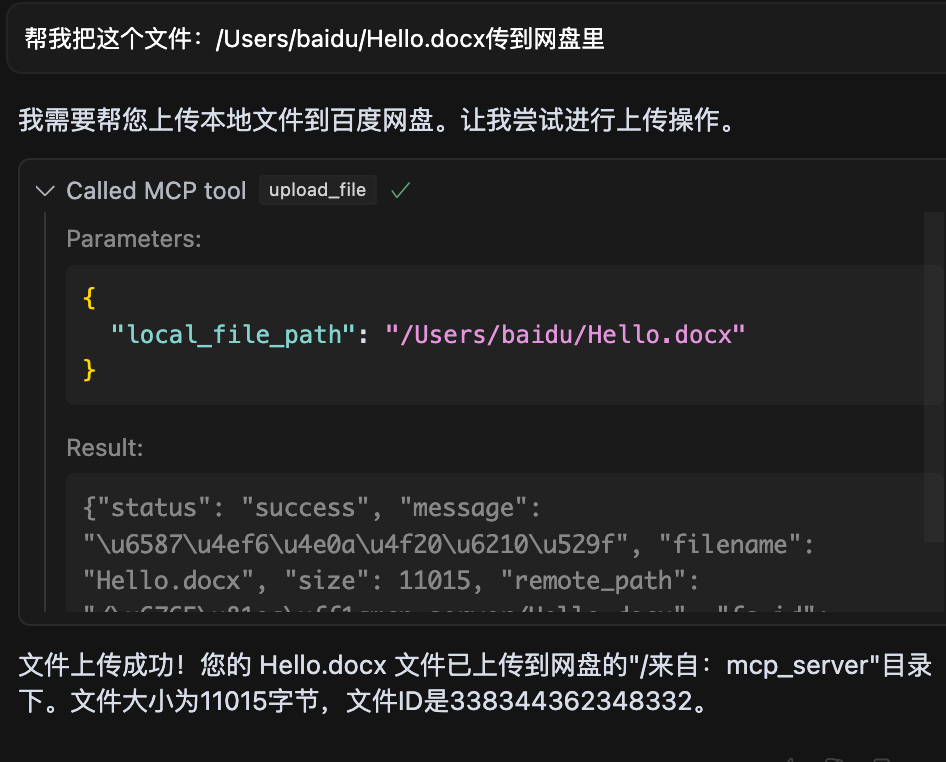
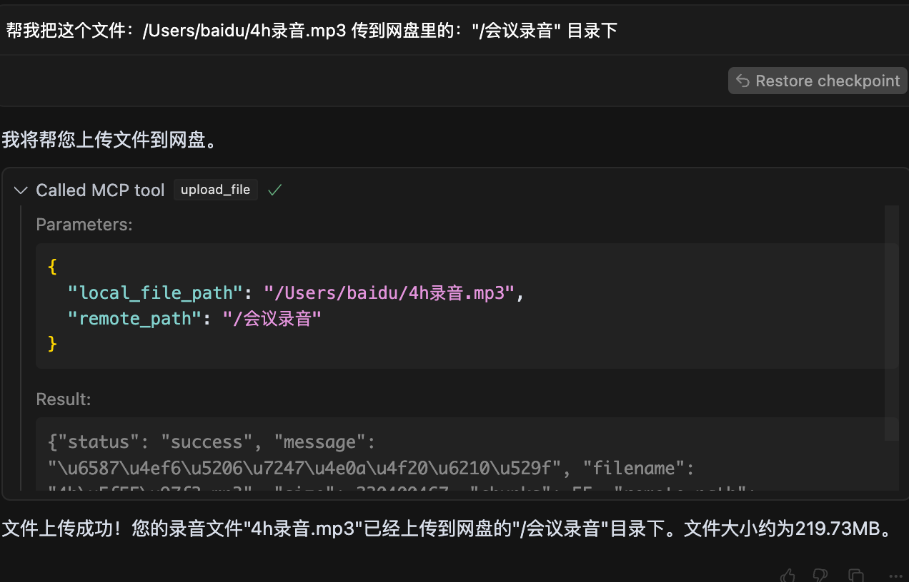

## Baidu Netdisk MCP Server (Python)
### 搭建Python虚拟环境
我们推荐通过`uv`构建虚拟环境来运行MCP server，关于`uv你可以在[这里](https://docs.astral.sh/uv/getting-started/features/)找到一些说明。

按照[官方流程](https://modelcontextprotocol.io/quickstart/server)，你会安装`Python`包管理工具`uv`。除此之外，你也可以尝试其他方法（如`Anaconda`）来创建你的`Python`虚拟环境。

### 在Cursor中使用

打开`Cursor`配置，在MCP中添加MCP Server



在文件中添加如下内容后保存

```json
{
  "mcpServers": {
    "baidu-netdisk-local-uploader": {
      "command": "uv的绝对路径，通过which uv命令获取，如/Users/netdisk/.local/bin/uv",
      "args": [
          "--directory",
          "netdisk.py所在的父目录绝对路径，如/Users/netdisk/mcp/netdisk-mcp-server-stdio",
          "run",
          "netdisk.py"
      ],
      "env": {
        "BAIDU_NETDISK_ACCESS_TOKEN": "<YOUR_ACCESS_TOKEN>"
      }
    }
  }
}

```

回到配置，此时百度网盘MCP Server已经启用



### 测试

上传文件到网盘测试用例



